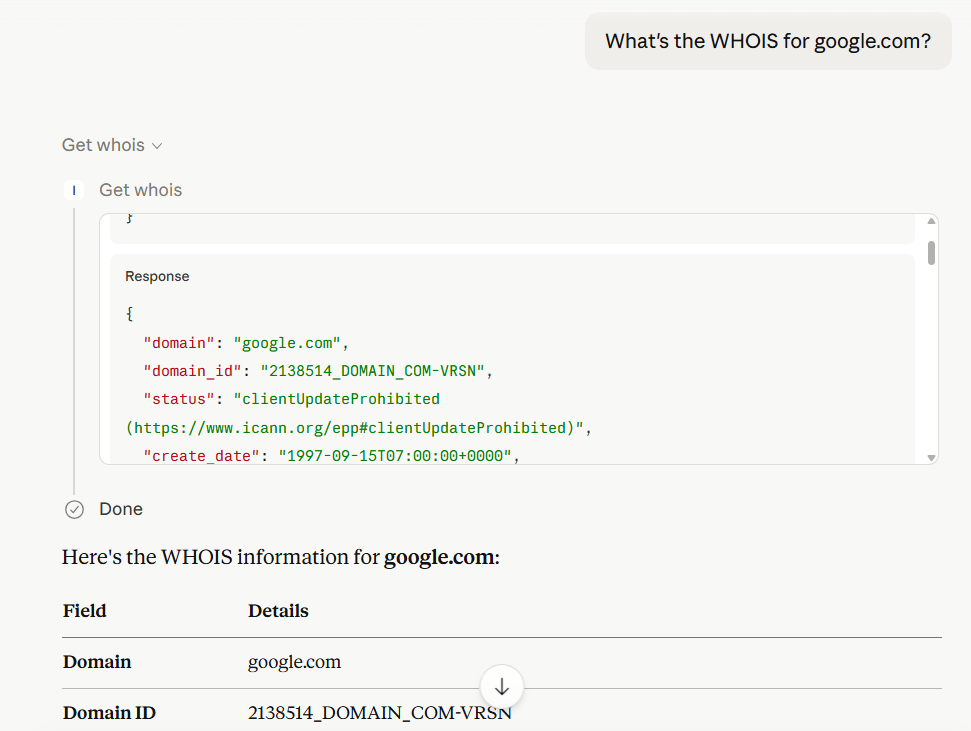

# IP2WHOIS MCP Server

A Model Context Protocol (MCP) server that provides comprehensive WHOIS lookup capabilities using the **IP2WHOIS API**. This server allows AI agents to query domain registration details, including expiry dates, registrar information, and registrant data.

## Features

-   **Domain Lookup**: Retrieve detailed WHOIS data for any domain name.
    
-   **Comprehensive Data**: Includes domain age, nameservers, registrar info, and administrative/billing contact details.
    
-   **FastMCP Framework**: Built using the high-performance FastMCP Python framework.

## Requirement

This MCP server requires an API key to work. You can [sign up](https://www.ip2location.io/sign-up) for a free API key and enjoy up to 500 queries per month.

The setup also use `uv`, which can be install by following [the guide](https://modelcontextprotocol.io/quickstart/server#set-up-your-environment).

## Setup

Follow the steps to use this MCP server with Claude Desktop:
 1. Download the repository to your local.
 2. Setup the `uv` package manager, you can once again refer to [the guide](https://modelcontextprotocol.io/quickstart/server#set-up-your-environment) to do so.
 3. Make sure you have installed the Claude Desktop, if you haven't, kindly download from [here](https://claude.ai/download) for Windows and MacOS users, or follow [this guide](https://modelcontextprotocol.io/quickstart/client) for Linux user.
 4. Open the `claude_desktop_config.json` in your choice of editor, if you do not having one yet, follow [this guide](https://modelcontextprotocol.io/quickstart/server#testing-your-server-with-claude-for-desktop) to create one.
 5. Add the following to your `claude_desktop_config.json`:

```json
{
  "mcpServers": {
    "ip2whois": {
      "command": "uv",
      "args": [
        "--directory",
        "/path/to/ip2whois/src",
        "run",
        "server.py"
      ],
      "env": {
        "IP2WHOIS_API_KEY": "<YOUR API key HERE>"
      }
    }
  }
}
```
 6. Remember to replace the `/path/to/ip2whois`  path with your actual path to IP2WHOIS MCP server in local.
 7. To get your API key, just [login](https://www.ip2location.io/log-in) to your dashboard and get it from there. Replaced the `<YOUR API key HERE>` in above with your actual API key.
 8. Restart the Claude Desktop after save the changes, and you should see it appear in the `Search and tools` menu.

## Usage

Just enter your query about the IP in a chat in Claude Desktop. Some of the example query will be:

- Who is the registrar of the (domain)?
- Who is the owner of (domain)?
- What is the WHOIS for (domain)?

For instance, below is the result of the domain google.com:



In Claude Desktop, the model will automatically generate the output based on the result returned by IP2WHOIS MCP server.

## Environment Variable

`IP2WHOIS_API_KEY`

The IP2WHOIS API key, which allows you to query up to 500 per month for free and more details of the IP address. You can [sign up](https://www.ip2location.io/sign-up) for a free API key, or [subscribe](https://www.ip2location.io/pricing) to a plan to enjoy more benefits.
 
## Tools

### `get_whois`

Look up WHOIS data for a domain name.

-   **Arguments**:
    
    -   `domain` (string): The domain name to look up (e.g., `google.com`).
        
-   **Output**: Returns a JSON object containing:
    
    -   `domain_id`, `status`, `domain_age`
        
    -   `create_date`, `update_date`, `expire_date`
        
    -   `registrar` (name, url, etc.)
        
    -   `registrant` (name, organization, country)
        
    -   `nameservers`

## License

See the LICENSE file.